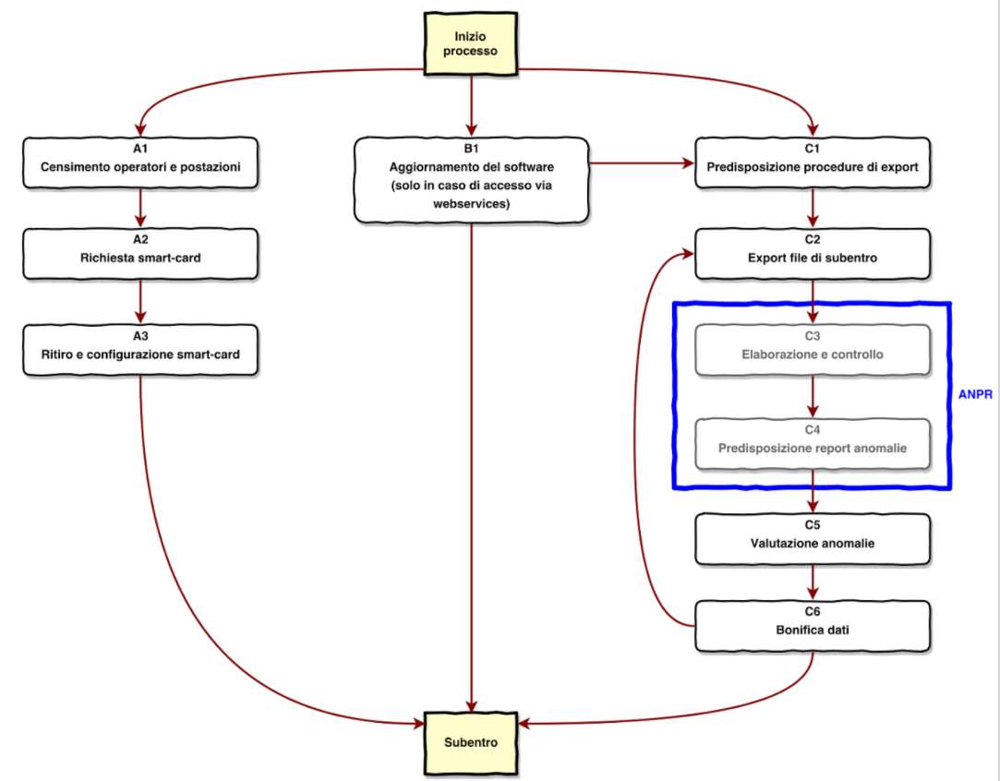

Le attività per il subentro di un Comune
========================================

.. WARNING::
	Il documento è da ritenersi in versione beta.
	
L’esperienza dei Comuni subentrati dimostra che **è possibile passare ad ANPR**, anzi che ANPR funziona.

Gli obiettivi del subentro sono:

- **Migrazione dei dati dalle APR / AIRE locali ad ANPR.** I dati presenti nelle APR / AIRE locali sono trasferiti al sistema ANPR, favororendo l’allineamento dei codici fiscali associati ai soggetti così come attribuiti dall’Agenzia delle Entrate.
- **Integrazione degli APR locali con il sistema ANPR.** I Comuni che decidono di utilizzare le APR locali si assicurano che al momento della migrazione dei dati i propri sistemi siano integrati tramite i web services esposti dal sistema ANPR al fine di garantire l'immediata registrazione degli eventi anagrafici relativi ai cittadini residenti nel proprio territorio in ANPR.

L'esperienza dei Comuni subentrati forniscono indicazioni sulle attività che i Comuni devono realizzare per raggiungere gli obiettivi del subentro. 

L'esperienza realizzata dai Comuni subentrati in ANPR si evidenzia che le attività che i Comuni realizzano, insieme alle loro software house, sono:

- **Aggiornamento del software** delle APR locali per l'integrazione con il sistema ANPR attraverso i web services esposti da quest'ultimo.
- **Predisposizione delle procedure di ETL** (estrazione, trasformazione e caricamento) per la predisposizione dei file di subentro da inoltrare al sistema ANPR.
- **Bonifica delle anomalie**, ove necessario dei dati anagrafici, segnalate dal sistema ANPR a valle dell'elaborazione del file di subentro inoltrato dal Comune.
	
.. Important::
	I *35 Comuni che sono subentrati* in ANPR e i *951 che sono in fase di pre-subentro* ha coinvolto la quasi totalità delle software house interessate.
	L'esperienza maturata dalla software house permette ai Comuni di concentrano sull'azione di **bonifica**.
	
.. Note::
	948 Comuni in pre-subentro (11,88% dei Comuni italiani)
	
	35 Comuni subentrati (0,44% dei Comuni italiani)
	860.843 Cittadini subentrati (1,42% della popolazione italiana)
	  
	*Dati raccolti al 16/12/2017 dal sistema ANPR*
	 
	
L'insieme di task che i Comuni devono realizzare per dare seguito alla **bonifica** dei dati anagrafici, per cui siano riscontrate anomalie, è sintetizzato nella seguente figura.

Relativamente al task **valutazione anomalie** che il Comune realizza sulla base delle anomalie riscontrate da ANPR sulla base dei dati inviati tramite il file di subentro, la stessa è realizzata attraverso la:

- valutazione costi/benefici relativamente alla bonifica delle anomalie riscontrate;
- individuazione delle anomalie da correggere prima del subentro e quelle da posticipare alla fase di esercizio.

Si ricorda che le anomalie tracciate da ANPR sono suddivisibili in due macro-categorie, nel dettaglio:

- **89 Anomalie sui dati anagrafici**, la cui correzione vedrà direttamente coinvolto gli ufficiali anagrafici nel dare seguito alle necessarie istruttorie per constatare la corretto valorizzazione dei dati anagrafici stessi;
- **30 Anomalie sui file di subentro**, che riguardano la formazione dei file per il trasferimento dall’APR locale all’ANPR e, per la loro natura, vedano direttamente interessati i tecnici informatici che predispongono i file.

Nel dettaglio le 119 anomalie tracciate da ANPR nella fase di pre-subentro e subentro sono:

- **1 anomalia ERRORE** sui dati anagrafici (ES092 - Soggetto senza scheda famiglia/convivenza associata);
- **30 anomalie ERRORE** sui file di subentro (ad esempio: EN012 - Totale schede soggetto dichiarato per l'intera fornitura incongruente con quello calcolato);
- **88 anomalie WARNING** sui dati anagrafici (ad esempio: EC030 - Stato estero di nascita inesistente sulla tabella di riferimento).

.. Important::
	Le uniche anomalie che impediscono ad comune di subentrare sono quelle classificate come ERRORE. 
	
	Vi è un'**unica anomalia sui dati anagrafici che impedisce ad un comune di subentrare in ANPR**, determinata dal *Regolamento anagrafico della popolazione residente* (DPR 223/1989), è viene segnalata nel caso un cui sia presente una persona senza scheda famiglia/convivenza associata.

.. Note::
	7.617.298 Schede soggetto trattate da ANPR (12,57% della popolazione italiana)
	
	768.929 Totale anomalie riscontrate, di cui:

	- 103.905 anomalie legate al codice fiscale
	- 665.024 altre anomalie
	
	*Dati raccolti al 16/12/2017 dal sistema ANPR*
 
	
	

	

