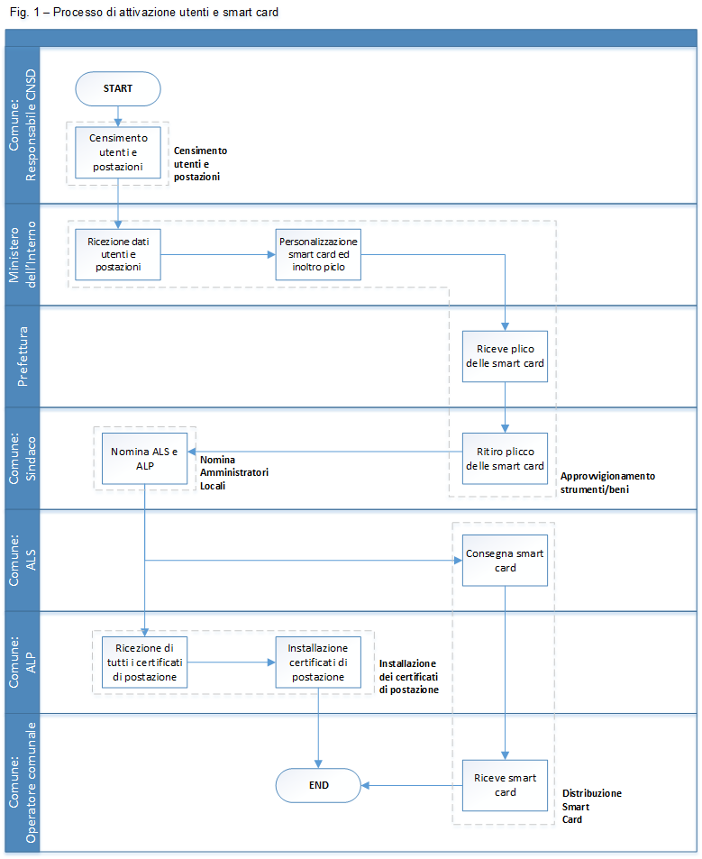

Procedura operativa
===================

La procedura operative riportata nella seguente figura sintetizza le azioni che un Comune e gli altri attori coinvolti realizzano per assicurarsi gli strumenti necessari per effettuare l’accesso al sistema ANPR. 

I soggetti coinvolti nella procedura descritta sono:

- il Ministero dell’Interno quale amministrazione presso cui è istituito l’ANPR;
- le Prefetture, l’ufficio territoriale del governo che interviene nel processo di consegna ai Comuni della Smart Card e relativi lettori, per permettere l’accesso agli operatori al Comune;
- il Comune che richiede e riceve gli strumenti necessari per garantire, ai propri operatori, l’accesso al sistema ANPR:
  - il Sindaco del Comune, che rappresenta il primo referente; dell’amministrazione verso gli altri attori coinvolti, di specie Ministero dell’Interno, Prefettura e SOGEI;
  - il responsabile CNSD, il soggetto indicato dall’Amministrazione, indipendentemente dal progetto ANPR, per l’accesso ai servizi web del CNSD;
  - l’Amministratore Locale della Sicurezza (ALS) è il soggetto individuato dal Sindaco del Comune a cui è affidato la gestione e la consegna dei dispositivi necessari agli operatori (Smart Card e lettori) comunale che devono utilizzare il sistema ANPR;
  - l’Amministratore Locale delle Postazione (ALP) è il soggetto individuato dal Sindaco del Comune a cui è affidata la gestione e configurazione delle postazioni utilizzate dagli operatori comunale per accedere al sistema ANPR;
  - l’operatore comunale, ogni soggetto individuato dal Sindaco che, ha l'esigenza e i diritti per accedere alle funzionalità di  ANPR (tramite Web Application o tramite sistema comunale).

Oltre ai soggetti indicati, sebbene non presente nella procedura qui descritta, si evidenzia che SOGEI, ai sensi del’art 3 comma 4 del DPCM 194/2014l , assicura il supporto ai Comuni per le azioni di installazione e configurazione dei certificati, delle Smart Card e i relativi lettori. 

Si precisa che quanto di seguito descritto si concentra sulle attività che il Comune deve realizzare e le interazioni di questo con gli altri attori coinvolti.

Nei seguenti paragrafi si descrive con un maggiore dettaglio le azioni che realizzano la procedura sintetizzata nella figura precedente.

Censimento utenti e postazioni
^^^^^^^^^^^^^^^^^^^^^^^^^^^^^^

L’attività di censimento degli utenti e delle postazioni è effettuata dal Comune con l’obiettivo di comunicare al sistema ANPR le informazioni necessarie - operatori comunali, numero di postazioni, ecc. - alla produzione dei dispositivi di sicurezza certificati di postazioni, credenziali e Smart Card.

A valle del censimento interno all’Amministrazione, il responsabile comunale degli accessi a `Centro Nazionale Servizi Demografici (CNSD) <http://servizidemografici.interno.it/>`_ accede alla funzionalità Censimento ANPR predisposta nella sezione SERVIZI PRINCIPALI / Area privata.

L'accesso alla funzionalità indicata in precedenza è assicurato ai Comuni che hanno avviato la procedura di subentro in ANPR nel rispetto del piano di migrazione predisposto nell’ambito del progetto ANPR. 

I dati che il Comune deve fornire per completare il censimento sono:

- riferimento degli operatori e numero di postazioni censite;
- PEC istituzionale del Comune utilizzata per le comunicazioni; 
- riferimenti del responsabile ANPR individuato dall’amministrazione.

Le azioni descritte nel presente paragrafo sono rappresentate nella fig. 1 dal task denominato “Censimento utenti e postazioni” in carico del Comune.

Approvvigionamento dei dispositivi di sicurezza
^^^^^^^^^^^^^^^^^^^^^^^^^^^^^^^^^^^^^^^^^^^^^^^

Il Ministero dell’Interno acquisisce i dati inoltrati dal Comune è assicura l'approvvigionamento dei dispositivi di sicurezza: certificati di postazioni, credenziali, Smart Card e lettori di Smart Card.

Nello specifico provvede a garantire la personalizzazione delle Smart Card ed al loro inoltro alle Prefetture, individuato quale organo di governo periferico per assicurare la consegna delle Smart Card ai Comuni. La produzione delle Smart Card prevede che le stesse siano custodite in una busta che contiene la prima parte del PIN, del PUK e metà della password di accesso da utilizzare in caso di impossibilità di utilizzo della Smart Card.

La Prefettura, dopo aver ricevuto il plico delle Smart Card, convoca il sindaco per la consegna delle Smart Card e provvede alla consegna delle stesse al sindaco o un suo delegato.

Le azioni descritte nel presente paragrafo sono rappresentate nella fig. 1 nei seguenti task:

- “Ricezione dati utenti e postazioni” e “Personalizzazione Smart Card ed inoltro” in carico del Ministero dell’Interno, 
- “Riceve plico delle Smart Card” in carico della Prefettura 
- “Ritiro delle Smart Card” in carico al Comune. 

Nomina Amministratori Locali
^^^^^^^^^^^^^^^^^^^^^^^^^^^^

Contestualmente alla comunicazione di avvenuta consegna da parte della Prefettura, il sindaco riceve alla sua casella di posta elettronica, indicata nella fase di censimento, la restante metà del PIN del PUK e metà della password di accesso. Di seguito occorre:

- configurare la postazione;
- installare il certificato e la Smart Card (vedi `procedure strumentali <procedure-strumentali>`_).

Tali attività sono necessarie per le successive azioni di assegnazione dei diritti di Amministratore Locale della Sicurezza (ALS) e Amministratore Locale delle Postazioni (ALP), i soggetti individuati dall’amministrazione comunale a cui sono assegnate, rispettivamente, le funzioni per la gestione degli utenti e, in particolare, la consegna delle Smart Card agli operatori comunali e la gestione/installazione dei certificati delle postazioni abilitate ad interagire con il sistema ANPR.

Il Sindaco accede alla Web Application ANPR, all’URL `https://dp.anpr.interno.it/com <https://dp.anpr.interno.it/com>`_, effettuando il login con la propria Smart Card.
Attraverso le funzionalità presenti nella sezione Sicurezza il Sindaco :

-	nomina l’Amministrazione Locale della Sicurezza e l’Amministratore Locale delle Postazioni assicurandogli i relativi ruoli;
-	consegna della Smart Card all’Amministrazione Locale della Sicurezza ed alla sua registrazione attraverso l’utilizzo della funzionalità “Registra Smart Card Comune”;
-	consegna la busta con metà del PIN, del PUK e della password di accesso della Smart Card all’Amministrazione Locale della Sicurezza
-	consegna, all’Amministrazione Locale della Sicurezza, il plico che contiene le restanti SC del comune con relative buste che l’ALS consegnerà successivamente ai rispettivi titolari.

Contestualmente alla registrazione sulla Web Application ANPR dell’Amministratore Locale della Sicurezza, questi riceve alla sua casella di posta elettronica la restante metà del PIN del PUK e della password di accesso. 

Le azioni descritte nel presente paragrafo sono rappresentate nella fig. 1 dal task denominato “Nomina ALS e ALP” in carico al Comune.

Distribuzione Smart Card
^^^^^^^^^^^^^^^^^^^^^^^^

L’Amministratore Locale della Sicurezza accede alla Web Application ANPR, all’URL `https://dp.anpr.interno.it/com <https://dp.anpr.interno.it/com>`_, effettuando il login con la propria Smart Card dalla postazione configurata con il relativo certificato o in alternativa da altra postazione purché si dia seguito alla procedura di installazione del certificato di postazione.

Le funzionalità per dare seguito all’azione di assegnazione delle Smart Card agli operatori comunali da parte dell’Amministratore Locale della Sicurezza sono disponibili nella sezione Sicurezza della Web Application ANPR, e nel dettaglio “Gestione Smart Card” e “Registra Smart Card Comune”.
Nel dettaglio:

- l’Amministratore Locale della Sicurezza consegna agli operatori comunali, tra cui anche l’Amministratore Locale delle Postazioni, la Smart Card unitamente alla busta con la metà del PIN, del PUK e della password di accesso e, attraverso le funzionalità esposte dalla Web Application ANPR, provvede alla comunicazione della consegna/assegnazione delle Smart Card;
- gli operatori comunali a cui è stata consegnata la Smart Card ricevono sulla propria casella di posta elettronica la restante metà del PIN, del PUK e della password di accesso.

Le azioni descritte nel seguente presente sono rappresentate nella fig. 1 dai task denominati “Consegna Smart Card” e “Riceve Smart Card” in carico al Comune.

Installazione dei certificati di postazione
^^^^^^^^^^^^^^^^^^^^^^^^^^^^^^^^^^^^^^^^^^^

L’Amministratore Locale delle Postazioni, a valle della nomina e della ricezione della Smart Card, accede alla Web Application ANPR, all’URL `https://dp.anpr.interno.it/com <https://dp.anpr.interno.it/com>`_, effettuando il login con la propria Smart Card dalla postazione configurata con il relativo certificato o in alternativa da altra postazione purché si dia seguito alla procedura di installazione del certificato di postazione.

Per dare seguito alle proprie azioni, l’Amministratore Locale delle Postazioni, utilizza la funzione “Gestione postazione – Ricerca postazione” nella sezione Sicurezza della Web Application ANPR.

E’ possibile ricercare tutti i certificati di postazione selezionando il bottone Ricerca.

I certificati presenti nella lista della sezione Elenco postazioni coincidono con il numero di postazioni dichiarate dal comune al momento del censimento utenti. 

Selezionando l’icona lente presente nella colonna dettaglio è possibile visualizzare la password del relativo certificato e scaricare il file tramite il bottone Scarica certificato.

E' possibile effettuare il download di tutti i certificati da installare con una sola operazione selezionando il bottone “Scarica tutti” e salvando il file compresso. 

Il file contiene tutti i certificati e un file .txt con le relative password.

Successivamente al download dei certificati, l’Amministrazione Locale delle Postazione provvede ad installare i certificati sulle postazioni che saranno utilizzate dagli operatori comunali per accedere ad ANPR. Per maggiori dettagli su come installare i certificati di postazione si rimanda al successivo paragrafo 3.2. 

Le azioni descritte nel seguente presente sono rappresentate nella fig. 1 dai task denominati “Consegna Smart Card” e “Riceve Smart Card” in carico al Comune.

