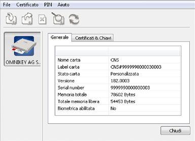
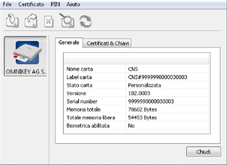

Procedura strumentali
=====================

Di seguito sono descritte in maggior dettaglio le principali procedure da seguire per il completamento di quanto previsto nel processo operativo.

Configurazione lettore Smart Card
^^^^^^^^^^^^^^^^^^^^^^^^^^^^^^^^^
L’utilizzo delle Smart Card, oltre alla conoscenza dei PIN, PUK e password per l’accesso, necessità delle attività di seguito descritte da realizzarsi sulle postazioni da cui gli operatori comunali accederanno alla Web Application ANPR.

Installazione lettore Smart Card
--------------------------------

Il lettore fornito ai Comune per l’utilizzo delle Smart Card si caratterizza per tecnologia plug&play che, nei moderni sistemi operativi, possono essere messe in uso all'interno di un sistema hardware o/e software senza che l'utente del sistema conosca o metta in atto una specifica procedura di installazione o configurazione.

Dopo aver collegato il lettore al connettore USB del computer attendere che il sistema operativo comunichi all’utente che il dispositivo è installato e correttamente funzionante.

.. Important::
    Al fine di agevolare l’utilizzo del lettore fornito si suggerisce, al momento del censimento delle postazioni, di privilegiare postazioni con le seguenti caratteristiche:

    SO compatibili:
    
    - Windows XP/Vista/7/8/8.1 sia a 32 che a 64 bit 
    - Mac OS X sia a 32 che a 64 bit. 
    - Distribuzioni di Linux maggiormente diffuse sia a 32 che a 64 bit.

    Interfaccia: 
	
    - USB 2.0 Type A connector

Installazione driver Smart Card
-------------------------------

L’installazione del drive della Smart Card dipende dal sistema operativo presente sulla postazione; è possibile prelevare i relativi driver accedendo alla URL: `https://www.pec.it/download-software-driver.aspx <https://www.pec.it/download-software-driver.aspx>`_

Sotto la voce “Driver Smart/SIM Card” selezionando “CARD produttore Athena”, si potrà effettuare il download delle ultime versioni per Microsoft Windows, Linux e Apple MAC OS X.

.. Important::
    Di seguito si riportano i link diretto alle versioni attualmente disponibili. 
    
    - per WINDOWS `https://ca.arubapec.it/downloads/IDP_6.44.10_Windows.zip <https://ca.arubapec.it/downloads/IDP_6.44.10_Windows.zip>`_
    - per LINUX	`https://ca.arubapec.it/downloads/IDP6.33.02_LINUX.zip <https://ca.arubapec.it/downloads/IDP6.33.02_LINUX.zip>`_
    - per MAC OS `https://ca.arubapec.it/downloads/IDProtect_MAC_Manager+PinTool_6.37.zip <https://ca.arubapec.it/downloads/IDProtect_MAC_Manager+PinTool_6.37.zip>`_

Per completare l’installazione dei driver delle Smart Card si suggerisce:

- durante l'installazione dei driver della SC chiudere tutti i browser aperti;
- riavviare la postazione di lavoro ad installazione dei driver completata.

Può presentarsi il caso in cui è necessario riavviare la postazione di lavoro se si vuole utilizzare la Smart Card di un altro utente nel lettore della stessa postazione di lavoro.

Dopo il riavvio della postazione, occorre assicurarsi che sia presente l’applicativo “IDProtect Monitor” che consente di verificare le informazioni contenute all’interno della Smart Card, controllarne la corretta visibilità da parte del browser e gestire eventuali operazioni di cambio e sblocco PIN. 

Per effettuare tale verifica occorre:

- inserire la Smart Card nel lettore;
- verificare l’accensione della spia luminosa dello stesso;
- avviare l’applicazione “IDProtect Manager” per verificare che le informazioni contenute all’interno della Smart Card siano lette correttamente, in particolare il dato relativo al Serial Number del certificato;

- selezionando il Tab Certificati & Chiavi e utilizzando il PIN fornito, è possibile verificare le informazioni riguardanti il codice fiscale dell’utente titolare della Smart Card.

Configurazione delle postazioni
^^^^^^^^^^^^^^^^^^^^^^^^^^^^^^^
Le postazioni che saranno utilizzate dagli operatori comunali per interagire con il sistema ANPR devono essere munite di certificati di postazione.

.. Important::
    L’azione di configurazione è fortemente dipendente del browser in uso, di seguito si riportano alcune indicazioni di massima, rimandando le necessarie precisazioni alla documentazione del browser in uso.

Chrome (verificato su Versione 59)

1. accedere alla sezione “Impostazioni”
2. individuare la voce “Gestione Certificati”
3. importare il certificato attraverso la funzione “Importa”

Internet Explorer (verificato su Versione 11)

1. accedere alla sezione “Opzioni Internet”
2. selezionare la funzione “Certificati” dal tab “Contenuto”
3. importare il certificato attraverso la funzione “Importa”

Firefox (verificato su Versione 54)

1. accedere alla sezione “Opzioni”
2. selezionare la funzione “Mostra Certificati” dal tab “Avanzate”
3. importare il certificato attraverso la funzione “Importa”

