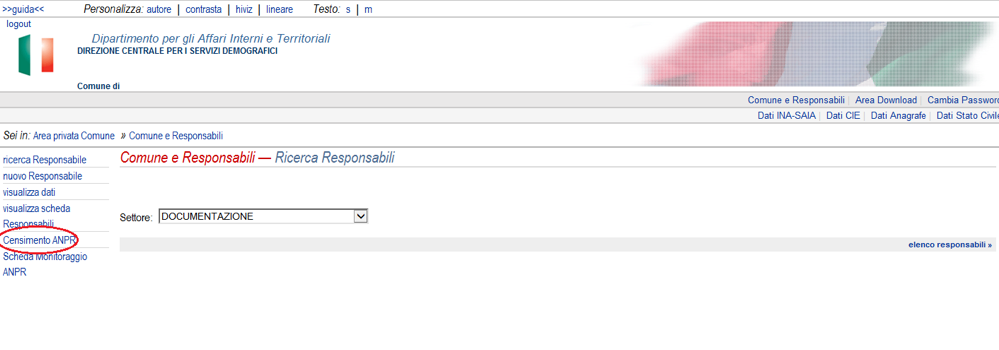

## Domande frequenti

### Perché dovrei far passare il mio comune ad ANPR?

Al di là degli obblighi legali che indicano come il passaggio ad ANPR per i
comuni sia obbligatorio, vi sono diversi vantaggi nella gestione delle pratiche
di tutti i giorni.

Potrete ad esempio evitare di inviare comunicazioni puntuali all'ISTAT, non
dipendere dal servizio INA-SAIA o ANAG-Aire, evitare le comunicazioni all'INPS,
ecc.

All'interno di [questo documento](../comuni/index.html) trovate una descrizione
più dettagliata dei vantaggi del passaggio ad ANPR.

### Cosa devo fare per passare ad ANPR?

È necessario pianificare il subentro del  comune, che è un'operazione che
coinvolge il fornitore di servizi tecnologici e l'ufficio anagrafe.
Innanzitutto va fatta una prova di subentro che determina quali anomalie devono
essere rimosse prima del subentro, quindi si pianifica il passaggio definitivo
del comune ad ANPR.

Se non avete ancora provveduto, contattate i vostri fornitori per pianificare i
passi successivi per il subentro in ANPR.

All'interno di [questo documento](../subentro/introduzione.html) trovate
un'introduzione al processo di subentro per il Comune.

### Cosa cambia per il mio comune con il passaggio ad ANPR?

Come già saprete, **alcuni regolamenti anagrafici cambiano al passaggio ad
ANPR**.

Questo perché alcune procedure vengono automatizzate, mentre l'integrazione con
altri database nazionali (per esempio, ISTAT, INPS, motorizzazione civile)
avviene in automatico, senza nessun lavoro da parte del comune.

All'interno di [questo documento](../comuni/index.html) informativo trovate
alcuni dettagli in più circa le obbligazioni dei comuni verso enti terzi, ed
alcune considerazioni su quello che cambia verso i vostri cittadini.

### Devo cambiare i sistemi utilizzati dagli ufficiali di Anagrafe?

**Generalmente no**. La maggior parte dei fornitori di software anagrafico ha
infatti scelto di integrare ANPR direttamente nel proprio pacchetto
applicativo, utilizzando la modalità *web services*.

Se il vostro fornitore ha quindi completato l'integrazione delle API
nell'applicazione che state usando oggi, non dovrebbe cambiare niente per
l'Ufficiale di Anagrafe, in termini di interfaccia e procedure.

Semplicemente, dietro le quinte, l'applicativo parlerà con il database
nazionale invece di quello locale.

Alcuni fornitori software hanno però deciso di legare il passaggio ad ANPR a
particolari versioni del loro software, o integrare le funzionalità del loro
prodotto con quelle della WebApp di ANPR.

Parlatene con il vostro fornitore.

Potete trovare l'elenco dei fornitori che ad oggi gestiscono
comuni passati ad ANPR a questo indirizzo: [https://dashboard.teamdigitale.governo.it/public/dashboard/2414d40b-9273-4e54-83ae-df346826fc53](https://dashboard.teamdigitale.governo.it/public/dashboard/2414d40b-9273-4e54-83ae-df346826fc53).

### Devo bonificare tutti i dati anagrafici per passare ad ANPR?

Assolutamente no, non è necessario rimuovere tutte le anomalie anagrafiche
prima del subentro perchè spesso questo significherebbe un aggravio di
operazioni e costi per il comune molto gravoso che può essere fatto nel tempo o
al momento in cui il cittadino si presenta allo sportello.

[Abbiamo prodotto questa documentazione](../subentro/index.html) che indica
cosa è necessario modificare prima di subentrare e cosa può essere rimandato ad
un successivo momento o al momento in cui il cittadino richiede una
certificazione.

### Quanto costa passare ad ANPR?

Il costo di passaggio ad ANPR dipende da due fattori:

1. Il costo del personale comunale per la bonifica dei dati

2. Il costo del fornitore per l'upgrade della versione del vostro gestionale ad
   una compatibile con ANPR e il supporto durante il processo di bonifica
   (prova di subentro e subentro).

Relativamente al primo punto, molto dipenderà da quante operazioni di bonifica
deciderete di fare oltre quelle strettamente necessarie per il subentro, mentre
per quanto riguarda il secondo punto dipende dal contratto che avete in corso e
se questo prevede già gli aggiornamenti software, in quel caso dovreste pagare
solo la consulenza del personale che vi supporta al subentro.

Il nostro intento, migliorando la documentazione, e automatizzando i processi
è quello di ridurre i costi per i comuni ma anche rendere il processo più
snello per le software house che, come naturale, non possono avere personale in
loco su tutti gli 8000 comuni.

### Quanto tempo ci si mette a passare ad ANPR?

Stiamo lavorando per automatizzare il processo, ma nel caso non vi siano
anomalie da correggere il processo può essere addirittura immediato. In base ai
processi avviati finora, il tempo medio richiesto è di circa **due mesi**
(maggiori informazioni nella pagina [Stima dei tempi per il subentro di un
Comune](../attivita-subentro/index.html).)

In ogni caso, tutte le pianificazioni di subentro passano per un test sulla qualità
dei dati che avviene con il cosiddetto "pre subentro". Questo consiste
nell'invio della propria APR locale a quella centrale per verificarne lo stato e
le anomalie.

In base a questo report il comune potrà bonificare i dati, solo se necessario,
e quindi procedere con il subentro definitivo.

### È vero che con il passaggio ad ANPR il mio comune dovrà dismettere il servizio X?

No, ANPR non nasce con l'intenzione di limitare il numero di servizi che il
vostro comune offre, anzi, in prospettiva consentirà di fornire servizi nuovi,
contribuire a costruire integrazioni automatiche con altri servizi e
semplificare la vita del cittadino.

### Devo cambiare hardware o connettività del comune per passare ad ANPR?

No, la comunicazione con ANPR è una comunicazione remota basata su scambio di
messaggi di pochi KB che non richiedono al comune di dotarsi di una
connettività supplementare rispetto a quella normalmente usata ad oggi.

Il vostro comune ha già in piedi queste comunicazioni per INA-SAIA ad esempio,
e il passaggio ad ANPR non rappresenta un considerevole incremento nella banda
richiesta per l'accesso ai servizi.

### Per passare ad ANPR, devo per forza utilizzare l'interfaccia web di ANPR? La WebApp?

**No.** Utilizzare la WebApp, l'interfaccia web messa a disposizione del
comune, è assolutamente a discrezione del Comune e del software che utilizzate,
è completamente opzionale.

L'interfaccia Web però è una finestra sui contenuti letti e mostrati
direttamente dal database nazionale. Ci sono quindi alcune operazioni di
verifica, correzione di errori, o altre operazioni molto rare, per cui vi potrebbe essere
richiesto di utilizzare l'interfaccia web.

### Quando verranno dismessi i Web Services?

**Non ci sono piani per la dismissione dei Web service.** Al contrario,
pianifichiamo di mantenerli e di farli crescere nel tempo come un meccanismo
primario di accesso ad ANPR.

Inizialmente, i Web service erano stati concepiti come un meccanismo per
consentire la migrazione ad ANPR, mantenendo poi la WebApp come unico
meccanismo per accedere e modificare i dati.

Ci siamo resi conto però che per consentire ai comuni di continuare a
beneficiare di tutte le integrazioni realizzate negli anni, e di mantenere i
processi cui erano abituati, nonché di realizzare nuove integrazioni in futuro,
è fondamentale fornire API e meccanismi di comunicazione automatica.

Questo è evidenziato anche nel Piano Triennale della Pubblica Amministrazione,
nonché nella nuova edizione del CAD.

### Richiesta abilitazione indirizzo IP

L’utilizzo dei web services ANPR in ambiente di produzione prevede che
venga preventivamente abilitato l’indirizzo ip del comune dal quale si
inviano tali richieste.

Le richieste di abilitazione dell’ip devono essere effettuate al momento
del censimento degli utenti nell’area riservata dei servizi demografici
al link:

[*http://areaprivata.servizidemografici.interno.it/sitoCNSD/security/logon.jsp*](http://areaprivata.servizidemografici.interno.it/sitoCNSD/security/logon.jsp)

Si accede con le credenziali dell’area riservata e si seleziona la voce
sulla sinistra Censimento ANPR

Oltre ai dati generali del Comune è previsto che sia l’indirizzo/i IP
e/o la NET di provenienza con il quale il comune intende connettersi ai
servizi ANPR. Nel caso non si fosse a conoscenza di tale indirizzo, si
suggerisce di contattare il proprio fornitore di connettività o in
alternativa di accedere, con un qualsiasi browser collegato alla rete
internet, al link https://www.myip.com. Lo stesso sito mostrerà in breve

l’indirizzo IP di provenienza. Si ricorda che l’indirizzo deve essere
pubblico e statico. Una volta inserito occorrerà premere il tasto
Aggiungi IP.

Tali ip, comunicati nel momento del censimento, vengono successivamente
resi disponibili sul sito web di ANPR, alla voce
Amministrazione-&gt;Gestione dati del comune, nella sezione
“Informazioni Aggiuntive” , in modo che possano essere eventualmente
eliminati e/o aggiunti ad altri ip

In caso di problemi o di particolari urgenze è possibile scrivere alla
casella di posta

[*ass.abilit\_ip.anpr@sogei.it*](mailto:ass.abilit_ip.anpr@sogei.it)

L’applicazione non consente l’inserimento di indirizzi privati quali :

-   192.168.\*

-   10.\*

-   172.16.\*

Le normali richieste di abilitazione ip effettuate attraverso questa
casella di posta non saranno prese in considerazione

### Le informazioni fornite in questo (o altri) documenti non corrispondono, cosa devo fare?

Stiamo lavorando per sistemare la documentazione e per avere tutte le informazioni
essenziali in un solo sito, ma se qualcosa non è coerente per favore
segnalatelo a
[segnalazioni-anpr@teamdigitale.governo.it](mailto:segnalazioni-anpr@teamdigitale.governo.it)

