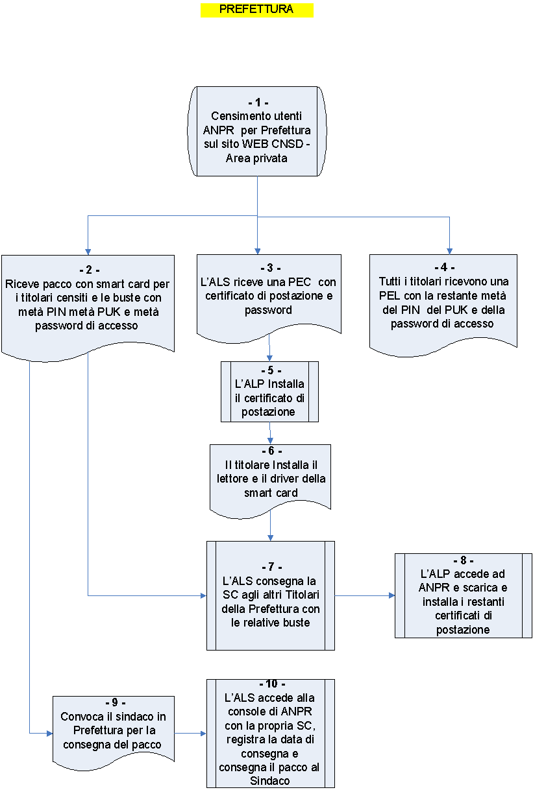
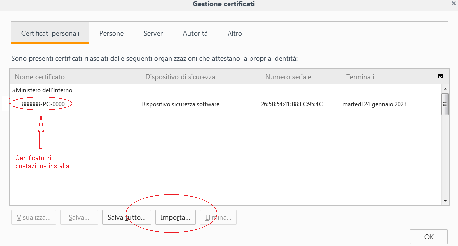
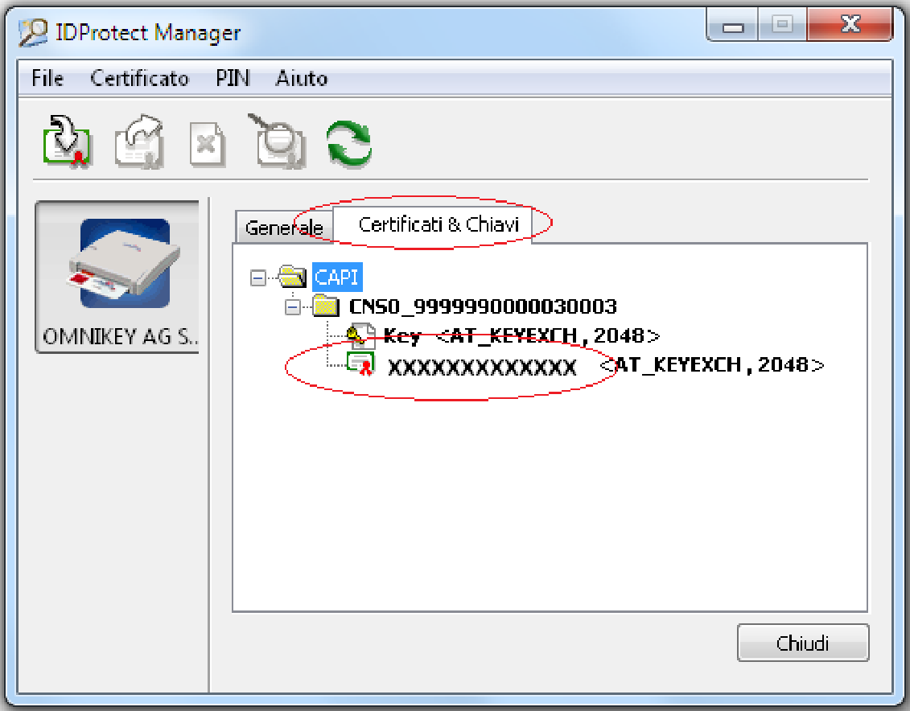

## 1. Premessa

Il presente documento sintetizza  il flusso delle attività necessarie per il primo censimento, per l’attivazione degli utenti e delle smart card, da completare per consentire la consegna delle smart card ai comuni di competenza, in previsione del loro subentro in ANPR.

Per un maggior dettaglio sulle operazioni occorre consultare la  Guida operativa disponibile in [www.anpr.interno.it](http://www.anpr.interno.it), guida ad ANPR, Censimento degli utenti e delle postazioni.

## 2. Passi da seguire

La FIGURA 1 riportata di seguito comprende tutti i passi previsti; ciascuna attività è identificata da un progressivo che coincide con il titolo del paragrafo la descrive.

### 2.1. Censimento degli utenti ANPR  della Prefettura

L’attività di censimento utenti è propedeutica al subentro dei comuni di competenza della Prefettura in ambiente di produzione.

Per effettuare il censimento degli utenti occorre:

* Accedere al sito WEB CNSD al link  http://servizidemografici.interno.it

* Selezionare la voce di menu SERVIZI PRINCIPALI/Area privata

* Effettuare il login con la propria utenza e la relativa password (l’utenza da utilizzare è quella che termina con le lettere "PR")

* selezionare la voce di menu a sinistra "Censimento ANPR".

Al momento, il numero massimo di postazioni previste per le Prefetture è cinque.

Dovrà essere inserito almeno un utente con il profilo di "Amministratore Sicurezza (ALS)" e uno con “Amministratore Postazioni (ALP)” per un massimo di cinque utenti. Ciascun utente censito sarà titolare di smart card.

### 2.2. Ricezione plico Smart card

Dopo aver effettuato il censimento utenti, le smart card (SC nel seguito del documento) vengono personalizzate  e trasmesse  alla Prefettura che le ha richieste. La smart card è custodita in una busta che contiene la prima parte del PIN, del PUK e metà della password di accesso da utilizzare in caso di impossibilità di utilizzo della SC.

### 2.3. Invio PEC con certificato postazione

L’ALS riceve via PEC,  all’indirizzo fornito nella fase di censimento utenti, il primo certificato di postazione con la relativa password per poter effettuare le operazioni previste in questa fase.

### 2.4.  Invio PEL ai Titolari

Tutti gli utenti della Prefettura censiti ricevono nella propria casella di posta elettronica personale (PEL) la restante metà del PIN  del PUK e della password di accesso.

### 2.5. Installazione certificato postazione

L’utente censito come ALP installa il certificato di postazione sul p.c. dove poi saranno effettuate le operazioni successive in ANPR (consegna smart card, scarico certificati di postazione ecc.).

Se si utilizzano i browser Microsoft Internet Explorer o Google Chrome sarà sufficiente effettuare un doppio click sul certificato stesso e proseguire seguendo le istruzione presentate a video. In particolare occorrerà specificare la password d’installazione ricevuta via PEL insieme al certificato stesso.

Se si utilizza Mozilla Firefox occorre procedere con l’importazione del certificato attraverso il pannello delle opzioni del browser stesso.

Dal menù Opzioni scegliere Avanzate - Certificati – Mostra Certificati, spostarsi sul Tab dei Certificati Personali e procedere con il tasto Importa..

### 2.6. Installazione lettore e driver SC

Sulle postazioni certificate utilizzate dagli utenti della Prefettura occorre :

* installare il lettore SC

* Installare il driver della SC

#### 2.6.1. Lettore  SC

Generalmente nei sistemi operativi recenti il lettore di smart card fornito è riconosciuto ed installato nella modalità automatica plug&play.

Dopo aver collegato il lettore al connettore USB del computer attendere che il sistema operativo comunichi all’utente che il dispositivo è installato e correttamente funzionante.

#### 2.6.2. Driver  SC

Per installare il driver della smart card occorre accedere ai seguenti link:

* Per Windows:

[https://ca.arubapec.it/downloads/IDP_6.44.10_Windows.zip](https://ca.arubapec.it/downloads/IDP_6.44.10_Windows.zip)

* Per Linux:

[https://ca.arubapec.it/downloads/IDP6.33.02_LINUX.zip](https://ca.arubapec.it/downloads/IDP6.33.02_LINUX.zip)

N.B.  

* Durante l'installazione dei driver della SC chiudere tutti i browser aperti.

* Dopo l’installazione dei driver occorre RIAVVIARE IL P.C.

* A volte è necessario riavviare il p.c. se si vuole utilizzare la smart card di un altro utente nel lettore nello stesso P.C.

Dopo aver riavviato il p.c. verificare la presenza dei certificati, sia di postazione che della smart card, nelle opzioni avanzate del browser. Per esempio per Mozilla Firefox:

Il certificato utente ha come nome certificato il codice fiscale del titolare della SC.  

Dopo il riavvio del computer assicurarsi che nella barra delle applicazioni attive (o dalla lista dei processi attivi) sia presente l’applicativo "IDProtect Monitor", con il quale sarà possibile verificare le informazioni contenute all’interno della smart card, verificare la corretta visibilità da parte del browser e gestire eventuali operazioni di cambio e sblocco PIN.

Per effettuare tale verifica occorre:

* Inserire la smart card nel lettore

* Verificare l’accensione della spia luminosa dello stesso

* Avviare l’applicazione IDProtect Manager dal gruppo di applicazioni IDProtect Cliente e verificare che le informazioni contenute all’interno della smart card siano lette correttamente, in particolare il dato relativo al Serial Number del certificato.

Selezionando il Tab Certificati & Chiavi e utilizzando il PIN fornito, è possibile verificare le informazioni riguardanti il codice fiscale dell’utente titolare della smart card.

### 2.7. Consegna SC ai titolari

L’ALS consegna le SC agli altri titolari unitamente alle buste con metà del PIN del PUK e della password di accesso.

### 2.8. Download certificati di postazione

L’ALP accede ad ANPR con la propria SC, seleziona il link Sicurezza, e di seguito, la funzione Gestione postazione – Ricerca postazione.

E’ possibile ricercare tutti i certificati di postazione selezionando il bottone Ricerca.

I certificati presenti nella lista della sezione Elenco postazioni coincidono con il numero di postazioni dichiarate dal comune al momento del censimento utenti.

Selezionando l’icona lente presente nella colonna dettaglio è possibile visualizzare la password del relativo certificato e scaricare il file tramite il bottone Scarica certificato.

E' possibile effettuare il download di tutti i certificati da installare con una sola operazione selezionando il bottone "Scarica tutti" e salvando il file compresso sul p.c..

Il file contiene tutti i certificati e un file .txt con le relative password.

### 2.9. Convocazione del sindaco

Dopo l’arrivo del pacco con le SC in Prefettura, viene convocato il sindaco o un suo delegato per la consegna.

La delega può riguardare esclusivamente un operatore ANPR precedentemente censito per quel comune.

### 2.10. Consegna SC al sindaco

Per rendere effettiva la consegna delle SC al sindaco, l'ALS della Prefettura accede ad ANPR effettuando il login con la propria smart card, seleziona il link Sicurezza in alto a destra, la voce "GESTIONE SMARTCARD" e poi “Consegna smart card Prefettura”.

L’ALS consegna il pacco con le SC al sindaco unitamente alle buste contenenti metà del PIN, PUK e della password di accesso.
