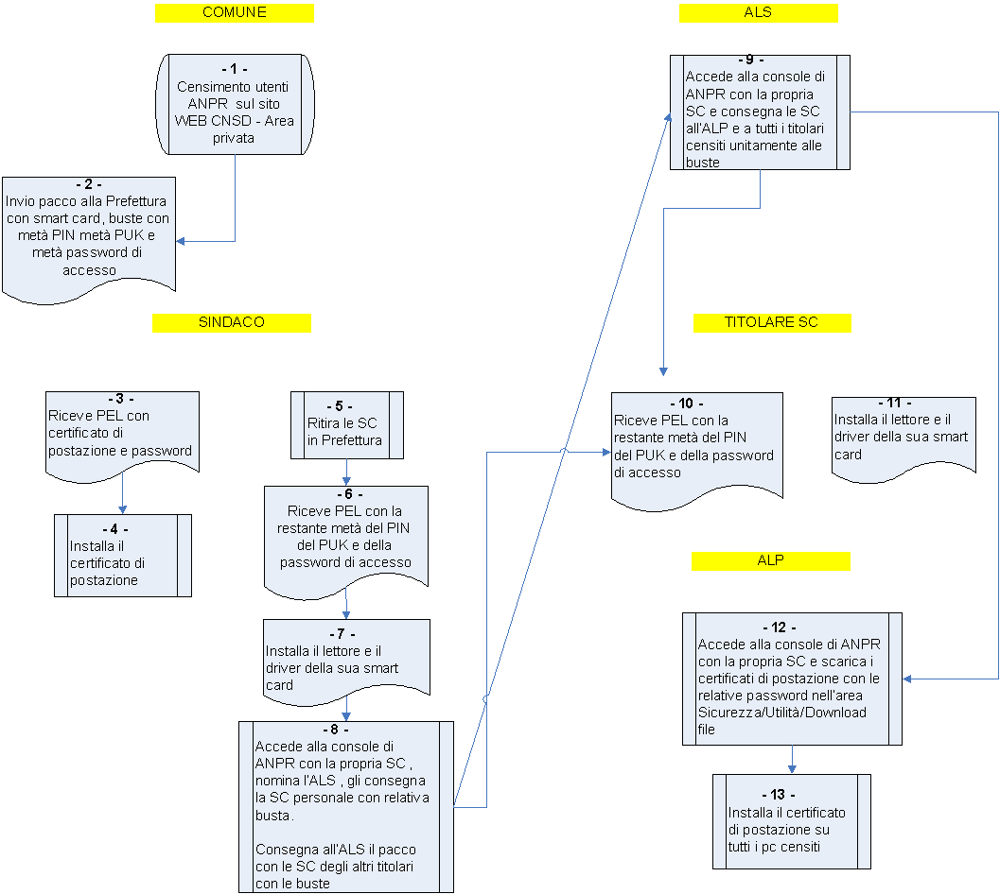
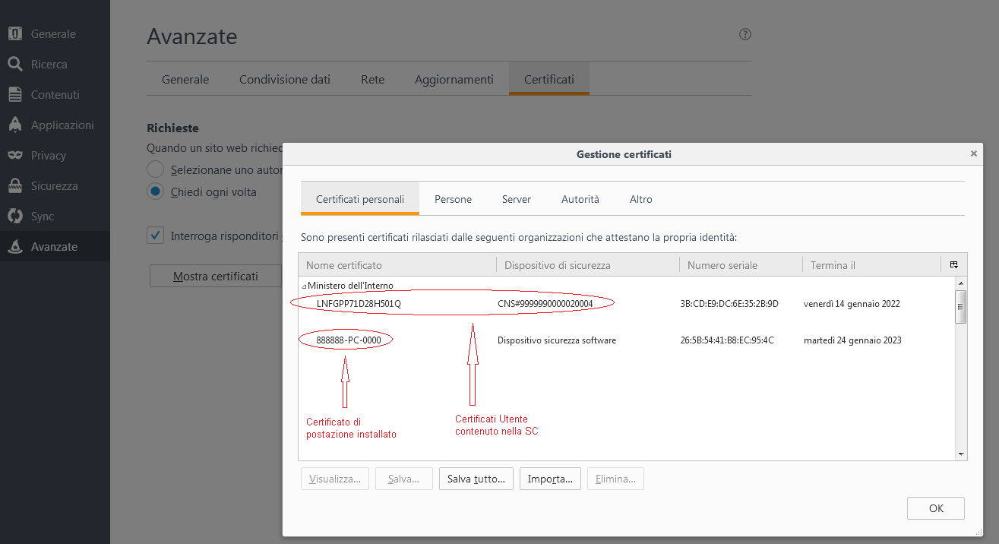
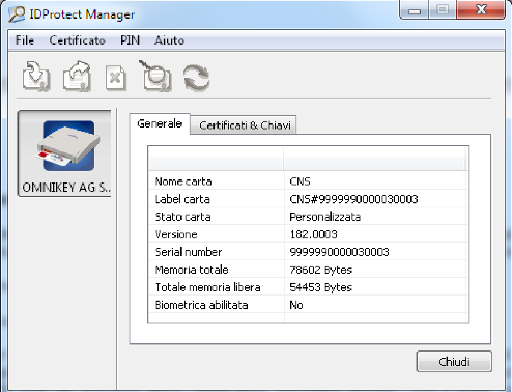

# Manuale operativo per i comuni
Prima attivazione di utenti e smart card ANPR

# Premessa

Il presente documento sintetizza  il flusso delle attività necessarie per il primo censimento, per l’attivazione degli utenti e delle smart card, propedeutico al subentro in ANPR.  subentro in ambiente di produzione per i Comuni.

Per un maggior dettaglio sulle operazioni occorre consultare la  Guida operativa disponibile sul Portale ANPR disponibile al link :

[www.anpr.interno.it](http://www.anpr.interno.it)

selezionando la voce "Censimento utenti e postazioni" presente nella sezione “In evidenza”  e poi all’interno del capitolo [6  - “Censimento degli utenti e delle postazioni](https://www.anpr.interno.it/portale/guida-anpr)” il seguente link:

[Guida operativa per il censimento degli utenti e delle postazioni e delle successive attività di consegna delle smart card - pdf](https://www.anpr.interno.it/portale/documents/20182/209632/Guida+operativa+censimento+utenti+e+postazioni+versione+16+gennaio.pdf/aaae609c-6af4-42b3-9d78-a33097100a3f)

La FIGURA 1 riportata di seguito descrive in maniera schematica tale flusso. All’interno di ogni box è riportato un numero che è utilizzato come indice per la descrizione riportata successivamente.

FIGURA 1

## 1 - Censimento degli utenti ANPR :

L’attività di censimento utenti è propedeutica al subentro del comune in ambiente di produzione.

Per effettuare il censimento degli utenti occorre:

* Accedere al sito WEB CNSD al link  **http://servizidemografici.interno.it **

* Selezionare la voce di menu SERVIZI PRINCIPALI/Area privata

* Effettuare il login con utenza è password (l’utenza da utilizzare è quella che termina con le lettere "CO")

* selezionare la voce di menu a sinistra "Censimento ANPR".

L’accesso alla suddetta funzionalità utenti è consentito, al massimo, con due mesi di anticipo rispetto alla data prevista per il subentro del comune, indicata nella PEC con la quale il comune ha ricevuto le credenziali per l’accesso all’ambiente di test e pre-subentro.

## 2 – Invio plico Smart card

Dopo aver effettuato il censimento utenti, le smart card (SC nel seguito del documento) vengono personalizzate  e trasmesse  alla Prefettura di riferimento. La smart card è custodita in una busta che contiene la prima parte del PIN, del PUK e metà della password di accesso da utilizzare in caso di impossibilità di utilizzo della SC.

## 3 – PEL con certificato postazione

Il sindaco riceve una mail nella casella di posta elettronica personale (PEL), fornita al momento del censimento utenti, contenente il primo certificato di postazione con la relativa password per poter effettuare le operazioni previste in questa fase.

## 4 – Installazione certificato postazione

Il sindaco installa il certificato di postazione sul p.c. dove poi saranno effettuate le operazioni successive (consegna smart card, definizione Amministratore locale sicurezza o ALS, definizione Amministratore locale delle postazioni o ALP ecc.).

Se si utilizzano i browser Microsoft Internet Explorer o Google Chrome sarà sufficiente effettuare un doppio click sul certificato stesso e proseguire seguendo le istruzione presentate a video. In particolare occorrerà specificare la password d’installazione ricevuta via PEL insieme al certificato stesso.

Se si utilizza Mozilla Firefox occorre procedere con l’importazione del certificato attraverso il pannello delle opzioni del browser stesso.

Dal menù Opzioni scegliere Avanzate - Certificati – Mostra Certificati, spostarsi sul Tab dei Certificati Personali e procedere con il tasto Importa.

## 5 – Ritiro smart card in Prefettura

La Prefettura, dopo aver ricevuto il plico delle smart card, convoca il sindaco per la consegna delle SC. La Prefettura accede alla consolle di ANPR e effettua la consegna della smart card  (plico che contiene tutte le buste degli utenti del comune) dopo aver comunicato l’evento tramite l’apposita funzionalità (quale).  

## 6 – Invio PEL al sindaco

Contestualmente alla comunicazione di avvenuta consegna da parte della Prefettura, il sindaco riceve alla sua casella di posta elettronica personale, indicata nella fase di censimento, la restante metà del PIN del PUK e metà della password di accesso.

## 7 – Installazione lettore e driver SC

Sulle postazioni certificate utilizzate da utenti provvisti di smart card occorre :

* installare il lettore SC

* Installare il driver della SC

### 7.1 –lettore  SC

Generalmente nei sistemi operativi recenti il lettore di smart card fornito è riconosciuto ed

installato nella modalità automatica plug&play.

Dopo aver collegato il lettore al connettore USB del computer attendere che il sistema operativo comunichi all’utente che il dispositivo è installato e correttamente funzionante.

### 7.2 – Driver  SC

Per installare il driver della smart card occorre accedere ai seguenti link:

Per Windows:		[https://ca.arubapec.it/downloads/IDP_6.44.10_Windows.zip](https://ca.arubapec.it/downloads/IDP_6.44.10_Windows.zip)

Per Linux	           [https://ca.arubapec.it/downloads/IDP6.33.02_LINUX.zip](https://ca.arubapec.it/downloads/IDP6.33.02_LINUX.zip)

**N.B.**

* Durante l'installazione dei driver della SC chiudere tutti i browser aperti.

* Dopo l’installazione dei driver occorre RIAVVIARE IL P.C.

* A volte è necessario riavviare il p.c. se si vuole utilizzare la smart card di un altro utente nel lettore nello stesso P.C.

* Dopo aver riavviato il p.c. verificare la presenza dei certificati, sia di postazione che della smart card, nelle opzioni avanzate del browser. Per esempio per Mozilla Firefox:

Il certificato utente ha come nome certificato il codice fiscale del titolare della SC.  

Dopo il riavvio del computer assicurarsi che nella barra delle applicazioni attive (o dalla lista dei processi attivi) sia presente l’applicativo "IDProtect Monitor", con il quale sarà possibile verificare le informazioni contenute all’interno della smart card, verificare la corretta visibilità da parte del browser e gestire eventuali operazioni di cambio e sblocco PIN.

Per effettuare tale verifica occorre:

* Inserire la smart card nel lettore

* Verificare l’accensione della spia luminosa dello stesso

* Avviare l’applicazione IDProtect Manager dal gruppo di applicazioni IDProtect Cliente e verificare che le informazioni contenute all’interno della smart card siano lette correttamente, in particolare il dato relativo al Serial Number.

Selezionando il Tab Certificati & Chiavi e utilizzando il PIN fornito, è possibile verificare le informazioni riguardanti il codice fiscale dell’utente intestatario della smart card.

## 8 – Nomina  ALS e consegna SC

Il sindaco accede ad ANPR effettuando il login con la propria smart card tramite il link:

[https://dp.anpr.interno.it/com](https://dp.anpr.interno.it/com)

e nomina l’Amministratore locale della sicurezza (ALS) associandogli il relativo ruolo. Per fare ciò seleziona il link Sicurezza presente  in alto a destra sulla home page e, di seguito, la funzione Gestione utenze/Modifica – Visualizza.

Successivamente il sindaco consegna:

* la  SC all’ALS selezionando la voce "GESTIONE SMARTCARD" e di seguito “Registra smart card Comune”.

* la busta con metà del PIN, del PUK e metà della password di accesso della SC

* il plico che contiene le restanti SC del comune con relative buste che l’ALS consegnerà successivamente ai rispettivi titolari.

## 9 – Consegna SC ai titolari

L'ALS accede ad ANPR effettuando il login con la propria smart card, seleziona il link Sicurezza presente in alto a destra sulla home page e, sulla pagina che si ottiene in risposta, seleziona la voce "GESTIONE SMARTCARD" e poi  “Registra smart card Comune”.

Effettua la consegna della SC all’ALP e a tutti gli altri titolari tramite la suddetta funzionalità di ANPR unitamente alla busta con metà del PIN del PUK e della password di accesso.

## 10 – Titolari ricevono PEL con credenziali

A valle della consegna della propria SC, i titolari ricevono nella loro mail personale  la restante metà del PIN del PUK e della password di accesso.

## 11 – Installazione driver SC

L’utente possessore di SC installa il lettore e il driver della SC. Per questa attività vedi paragrafo

7 – Installazione lettore e driver SC.

## 12 – Download certificati di postazione

L’ALP accede ad ANPR con la propria SC, seleziona il link Sicurezza, poi la funzione Gestione postazione – Ricerca postazione.

l’Amministratore locale può ricercare tutti i certificati di postazione selezionando il bottone Ricerca.

I certificati presenti nella lista della sezione Elenco postazioni coincidono con il numero di postazioni dichiarate dal comune al momento del censimento utenti.

Selezionando l’icona lente presente nella colonna dettaglio è possibile visualizzare la password del relativo certificato e scaricare il file tramite il bottone Scarica certificato.

E' possibile effettuare il download di tutti i certificati da installare con una sola operazione selezionando il bottone "Scarica tutti" e salvando il file compresso sul p.c.. Il file contiene tutti i certificati e un file .txt con le relative password.

## 13 – Installazione certificati di postazione

L’ALP provvede ad  installare i certificati di postazione scaricati con le modalità descritte nel paragrafo 4 sulle postazioni che avranno accesso ad ANPR.
