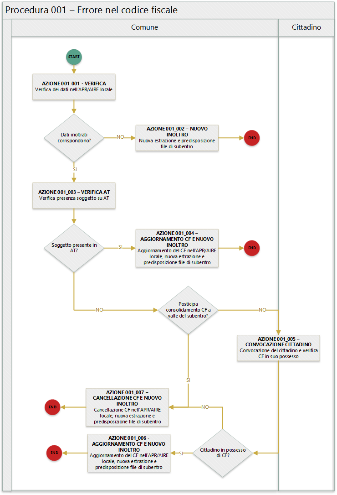

Procedura 001 - Errore nel CF
=============================

.. WARNING::
	Il documento è da ritenersi in versione beta.

In quanto segue si riporta la procedura suggerita ai Comuni per la gestione delle anomalie: 

- EA001 - Codice fiscale di lunghezza errata
- EA029 - Codice fiscale calcolato dai dati anagrafici del comune non presente in AT 
- EA038 - Soggetto con data di nascita non coincidente  con quella presente nel CF
- EA042 - Soggetto con sesso non coincidente  con quello presente nel CF
- EA048 - Codice fiscale formalmente errato
- EAA30 - Soggetto  presente in AT con dati anagrafici diversi
- EAA31 - Soggetto  presente in AT con dati anagrafici diversi	

.. Important::
	In fase di subentro ANPR segnala i cittadini AIRE che non sono mai entrati in Italia (nel caso di figli di italiani, ma nati all'estero) perché sconosciuto all'Agenzia delle Entrate, ma in questo caso l'anomalia NON può essere sanata perché l'attribuzione del CF deve essere preceduta una procedura di allineamento con gli schedari consolati, prevista dalla legge. Le modifiche vanno fatte solo per i cittadini APR.

Precondizione
^^^^^^^^^^^^^
Per dare seguito alla presente procedura è necessario che l'ufficiale d'anagrafe disponga:

- accesso al sistema gestionale del Comune con diritti di lettura e aggiornamento delle schede soggetto;
- accesso al sistema *SIATEL v2.0 - PuntoFisco* reso disponibile dall'Agenzia delle Entrate. 

Diagramma della procedura
^^^^^^^^^^^^^^^^^^^^^^^^^
La seguente figura sintetizza la procedura per la gestione delle anomalie.

Descrizione azione
^^^^^^^^^^^^^^^^^^
In quanto segue si riporta una descrizione delle azioni previsti per la presente procedura.

AZIONE 001_001 - VERIFICA
-------------------------
L'ufficiale d'anagrafe verifica i dati anagrafici associati al soggetto interessato dall'errore sul sistema gestionale del Comune con l'obiettivo di constatare che i dati inoltrati al sistema ANPR coincidono con quelli registrati. **Si evidenzia che l'ufficiale di anagrafe provvede anche al riscontro che i dati registrati nell'APR locale corrispondano con i dati registrati allo stato civile**

AZIONE 001_002 - NUOVO INOLTRO
------------------------------
Poichè i dati inoltrati al sistema ANPR non coincidono con quelli presenti nel sistema gestionale del Comune (probabilemente per problemi nella procedura di estrazione e predisposizione dei file di subentro utilizzata) è necessario provvedere nuovamente all'estrazione dei dati e alla predisposizione dei file di subentro al fine di provvedere ad eseguire l'inoltro al sistema ANPR.

AZIONE 001_003 - VERIFICA AT
----------------------------
L'ufficiale di anagrafe, tramite il sistema *SIATEL v2.0 - PuntoFisco* reso disponibile dall'Agenzia delle entrate, ricerca il soggetto nell'Anagrafe Tributaria e verifica il CF ad esso assegnato. Nel dettaglio attraverso le informazioni anagrafiche in suo possesso nome, cognome, sesso, luogo e data di nascita verifica se sull'Anagrafe Tributaria risulta soggetto ed in caso positivo prende nota del codice fiscale attribuito ad esso.

L'azione di verifica del soggetto in Anagrafe Tributaria risulta di estrema criticità in caso di disallineamento tra i dati presenti in essa e quelle presenti nell'APR locale, si suggerisce la consultazione della :doc:`procededura 000 - Verifica AT <procedura_000>`. 

AZIONE 001_004 - AGGIORNAMENTO CF E NUOVO INOLTRO
-------------------------------------------------
L’ufficiale di anagrafe, qualora riscontri che i dati dell’Agenzia delle Entrate sono corretti, li aggiorna sul proprio sistema gestionale del Comune per dare seguito ad una nuova estrazione dei dati e alla predisposizione dei file di subentro al fine di provvedere ad eseguire nuovamente l’inoltro al sistema ANPR. 
Qualora, al contrario, siano esatti i dati del comune, l’ufficiale di anagrafe non effettua alcun aggiornamento rinviando l’allineamento con l’Agenzia delle Entrate a valle del subentro.

AZIONE 001_005 - CONVOCAZIONE CITTADINO
---------------------------------------
L'ufficiale di anagrafe convoca il cittadino per verificare se lo stesso è in grado di attestare il *codice fiscale* ad esso attribuito dall'Agenzia delle entrate, ad esempio verificando la tessera sanitaria in suo possesso.

AZIONE 001_006 - AGGIORNAMENTO CF E NUOVO INOLTRO
-------------------------------------------------
L'ufficiale di anagrafe aggiorna il CF con le informazioni confutate in presenza del cittadino sul sistema gestionale del Comune per dare seguito ad una nuova estrazione dei dati e alla predisposizione dei file di subentro al fine di provvedere ad eseguire nuovamente l'inoltro al sistema ANPR.

AZIONE 001_007 - CANCELLAZIONE CF E NUOVO INOLTRO
-------------------------------------------------
L'ufficiale di anagrafe, non avendo la possibilità di riscontrare il *codice fiscale* provvede alla cancellazione dei dati relativi ai CF non corrispondenti sul sistema gestionale del Comune per dare seguito ad una nuova estrazione dei dati e alla predisposizione dei file di subentro al fine di provvedere ad eseguire nuovamente l'inoltro al sistema ANPR, rinviando l’allineamento con l’Agenzia delle Entrate a valle del subentro.

Riferimenti di interesse
^^^^^^^^^^^^^^^^^^^^^^^^
Nello specifico della presente procedure risultano di interesse:

- `regole di codifica <http://www.agenziaentrate.gov.it/wps/content/Nsilib/Nsi/Home/CosaDeviFare/Richiedere/Codice+fiscale+e+tessera+sanitaria/Richiesta+TS_CF/SchedaI/Informazioni+codificazione+pf/>`_ codice fiscale.