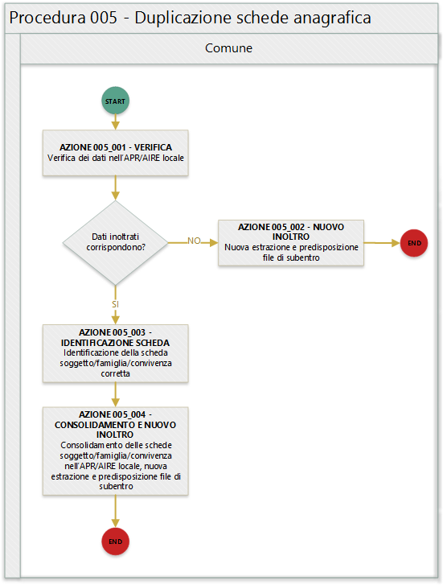

Procedura 005 - Duplicazione scheda anagrafica
==============================================

.. WARNING::
	Il documento è da ritenersi in versione beta.

In quanto segue si riporta la procedura suggerita ai Comuni per la gestione delle anomalie: 

- EA030 - CF di un soggetto residente  in più comuni
- EA031 - CF di un soggetto residente  sia in Italia che all'estero (AIRE)
- EA036 - Soggetto registrato più volte sia con il CF base che con quello che risolve l'omocodia
- EA040 - Soggetto registrato più volte  sia con il CF collegato che con l'ultimo
- EF003 - Sono presenti più schede famiglia/convivenza con lo stesso identificativo attribuito dal comune

Precondizione
^^^^^^^^^^^^^
Per dare seguito alla presente procedura è necessario che l'ufficiale d'anagrafe disponga:

- accesso al sistema gestionale del Comune (APR o AIRE locale) con diritti di lettura e aggiornamento delle schede soggetto.

Diagramma della procedura
^^^^^^^^^^^^^^^^^^^^^^^^^
La seguente figura sintetizza la procedura per la gestione delle anomalie.

Descrizione azione
^^^^^^^^^^^^^^^^^^
In quanto segue si riporta una descrizione delle azioni previsti per la presente procedura.

AZIONE 005_001 - VERIFICA
-------------------------
L'ufficiale d'anagrafe verifica i dati anagrafici associati al soggetto interessato dall'errore sul sistema gestionale del Comune (APR o AIRE locale) con l'obiettivo di constatare che i dati inoltrati al sistema ANPR coincidono con quelli registrati.

AZIONE 005_002 – NUOVO INOLTRO
------------------------------
Poiché i dati inoltrati al sistema ANPR non coincidono con quelli presenti nel sistema gestionale del Comune (probabilmente per problemi nella procedura di estrazione e predisposizione dei file di subentro utilizzata) è necessario provvedere nuovamente all'estrazione dei dati e alla predisposizione dei file di subentro al fine di provvedere ad eseguire l'inoltro al sistema ANPR.

AZIONE 005_003 – IDENTIFICAZIONE SOGGETTO
-----------------------------------------
L'ufficiale di anagrafe, o se necessario perché coinvolti più comuni gli ufficiali di anagrafe (come per l'EA030), realizzano le necessarie verifiche al fine di individuare quale sia la scheda soggetto e/o dati da considerare corretti.

AZIONE 005_004 - CONSOLIDAMENTO E NUOVO INOLTRO
-----------------------------------------------
L'ufficiale di anagrafe, sulla base delle verifica effettuata, provvede a consolidare le *schede soggetto* sul sistema gestionale del Comune per dare seguito ad una nuova estrazione dei dati e alla predisposizione dei file di subentro al fine di provvedere ad eseguire l'inoltro al sistema ANPR.
